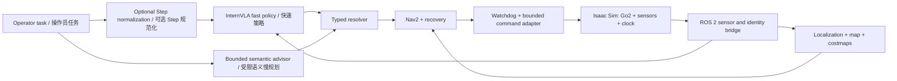

# E-MARS

**E-MARS — Edge-deployed Multimodal Agent for Robotic Search-and-rescue**
**E-MARS——基于端侧多模态 AI Agent 的自主消防救援机器人**

E-MARS is a ROS 2 navigation research stack that combines InternVLA fast
navigation, an optional Step model instruction-normalization layer, one bounded
semantic slow advisor, Nav2, recovery, watchdogs, and bounded robot control.
The `sim` branch uses NVIDIA Isaac Sim/Isaac Lab as the world, sensor, clock,
reset, and evaluation authority.

E-MARS 是一个 ROS 2 导航研究工程，组合 InternVLA 快速导航、可选的 Step
模型指令规范化层、受限的语义慢规划器、Nav2、恢复逻辑、watchdog 与有界控制。
`sim` 分支由 NVIDIA Isaac Sim/Isaac Lab 提供世界、传感器、仿真时钟、重置和
评测生命周期。

> [!IMPORTANT]
> This public repository contains source, configuration, and offline tests—not
> model weights, datasets, private scene assets, credentials, recorded sensor
> streams, benchmark results, or evidence bundles. The simulation branch does
> not certify physical Go2 safety or real-world motion performance.
>
> 本公共仓库仅包含源码、配置和离线测试；不包含模型权重、数据集、私有场景、
> 凭证、传感器录制、评测结果或证据包。仿真分支不能证明真实 Go2 的安全性或
> 实际运动性能。

## Documentation / 文档

- [Project overview / 项目说明](docs/project-overview.md)
- [Deployment guide / 部署说明](docs/deployment.md)
- [Technology stack / 技术栈说明](docs/technology-stack.md)
- [Development journal / 开发日志](https://strtatqwq.github.io/dgx-hackathon-Journal/)
- [Hardware repository / 硬件仓库](https://github.com/railgunqaq/unitree-go2-edge-ai-hardware)
- [Operator panel / 导航前端](https://github.com/strTATQwQ/vla-nav-panel)

## Branch contract / 分支合同

| Branch / 分支 | Purpose / 用途 | Safety boundary / 安全边界 |
| --- | --- | --- |
| `sim` | Isaac simulation, functional integration, replay, and evaluation / Isaac 仿真、功能集成、回放和评测 | May use explicitly marked `completion_sim` deviations; never authorizes real motion / 可使用显式记录的仿真放宽；绝不授权真机运动 |
| `real-go2` | Strict physical Go2 integration / 严格真机接入 | No GT pose, simplified dynamics, raw-wire bypass, or WARN-only safety inheritance / 禁止继承 GT pose、简化动力学、raw-wire 旁路和 WARN-only 安全策略 |

Simulation-only settings must never be copied into `real-go2`.
所有仿真专用配置都不得复制到 `real-go2`。

## System at a glance / 系统一览



The optional normalization layer is disabled by default so frozen episodes are
not changed. When enabled, select exactly one provider: local Step3-VL-10B or
hosted `step-3.7-flash`. The result is a schema-validated English canonical
mission and must be re-tokenized before InternVLA consumes it.

可选规范化层默认关闭，从而不改变冻结 episode。启用时必须在本地
Step3-VL-10B 与托管 `step-3.7-flash` 中二选一；输出为经过 schema 校验的英文
canonical mission，并必须重新生成与该文本匹配的 InternVLA token。

## Repository layout / 仓库结构

| Path / 路径 | Responsibility / 职责 |
| --- | --- |
| `internvla_ros2`, `internvla_ros2_msgs` | Typed InternVLA model/client protocol / InternVLA 模型与客户端类型化协议 |
| `internvla_t4_sensors` | Sensor, pose-source, reset, and observation gates / 传感器、位姿源、重置与观测门 |
| `internvla_nav2_adapter` | Typed navigation-command resolution / 类型化导航命令解析 |
| `internvla_t4_recovery` | Bounded no-progress and recovery behavior / 有界无进展检测与恢复 |
| `internvla_go2_controller` | Simulation command adapter / 仿真控制适配器 |
| `slow_planner`, `step3_graph_nav` | Step/Cosmos semantic planning and normalization / Step/Cosmos 语义规划与规范化 |
| `isaac_vln_benchmark` | Isaac runtime, sensors, episodes, reset, and evaluator / Isaac 运行时、传感器、episode、reset 与 evaluator |
| `slow_planner_frontend` | Operator-panel compatibility package / 操作员前端兼容包 |
| `configs`, `scripts`, `coordination` | Configuration, launchers, leases, and orchestration / 配置、启动器、资源租约与编排 |

## Quick start / 快速开始

```bash
git clone --branch sim https://github.com/strTATQwQ/E-MARS.git
cd E-MARS
cp .env.example .env.local
python -m pytest -q \
  tests/test_sim_mission_normalization.py \
  tests/test_t5_step3_deadline_contract.py \
  tests/test_t5_observation_identity_guard.py
```

Provision model weights, Isaac assets, ROS 2, and host-specific settings
outside Git, then follow the [deployment guide](docs/deployment.md).

模型权重、Isaac 资产、ROS 2 和主机专用配置应在 Git 外部准备，随后按照
[部署说明](docs/deployment.md)启动。

## License / 许可证

E-MARS is released under the [MIT License](LICENSE).
E-MARS 使用 [MIT License](LICENSE) 发布。
