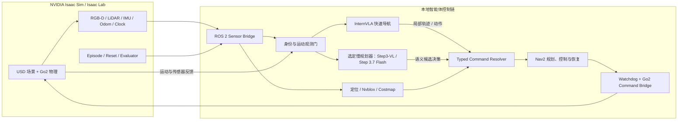

# E-MARS

**E-MARS** — **Edge-deployed Multimodal Agent for Robotic Search-and-rescue**

E-MARS is a ROS 2 navigation stack that combines multimodal language-guided
planning, InternVLA fast navigation, one selected slow advisor (Step3-VL-10B
or Step-3.7-Flash), Nav2, recovery behaviors, watchdogs, and bounded robot
control. The project targets edge deployment on NVIDIA DGX-class hardware
with Isaac Sim providing RGB-D, LiDAR, IMU, and Go2 simulation during
development.

中文全称：**基于端侧多模态 AI Agent 的自主消防救援机器人**。

## Documentation

- [Deployment guide](docs/deployment.md): local hardware topology, software
  baseline, model bring-up, health gates, and model optimization.
- [Technology stack](docs/technology-stack.md): NVIDIA SDKs, models, robotics
  middleware, communications, and fixed upstream revisions.
- [Development journal](https://strtatqwq.github.io/dgx-hackathon-Journal/):
  project motivation, control chain, engineering history, and public release
  boundary.

## Branches

- `sim`: Isaac Sim development and evaluation stack. This is the initial
  public branch.
- `real-go2`: strict physical Go2 integration. It is kept separate from
  simulation safety relaxations and will be published after stationary
  hardware integration is ready.

Simulation-only settings must never be copied into the physical-robot branch.
In particular, simulated pose sources, simplified motion, and relaxed
freshness or collision policies are not valid real-robot defaults.

## Architecture



选用 Step3-VL 时，它是系统的多视角语义慢规划层。它结合自然语言目标、场景图像、
导航历史和可达候选，为 frontier、viewpoint 或运动 primitive 提供语义比较和
高层决策，并与 InternVLA 快速路径在统一命令解析层汇合。模型不直接发布
底层速度；Typed Command Resolver 校验身份、时效和候选边界后，才把命令
交给 Nav2、恢复逻辑和 watchdog 执行。

The major source packages are:

- `internvla_ros2` and `internvla_ros2_msgs`: typed model and client protocol;
- `internvla_nav2_adapter`: Nav2 command resolution;
- `internvla_t4_recovery`: bounded recovery behavior;
- `internvla_t4_sensors`: sensor and odometry integration;
- `internvla_go2_controller`: bounded simulated Go2 control;
- `slow_planner` and `step3_graph_nav`: slow-planner components for the
  selected advisor;
- `isaac_vln_benchmark`: Isaac/ROS 2 simulation runtime;
- `slow_planner_frontend`: operator panel;
- `configs` and `scripts`: launch configuration and orchestration.

### Slow-advisor selection

The slow-advisor stage is required. Select exactly one model for a deployment:
either **Step3-VL-10B** or **Step-3.7-Flash**. The two choices are mutually
exclusive and must not be enabled together.

## Hardware

The physical Go2 hardware design, including power, cameras, installation
photos, and CAD models, is maintained in
[`railgunqaq/unitree-go2-edge-ai-hardware`](https://github.com/railgunqaq/unitree-go2-edge-ai-hardware).
The relative [`hardware`](hardware) symbolic link points to a sibling checkout
of that repository, so the hardware content can be updated independently.

Clone the software and hardware repositories side by side:

```bash
git clone https://github.com/strTATQwQ/E-MARS.git
git clone https://github.com/railgunqaq/unitree-go2-edge-ai-hardware.git
```

## Repository policy

Model weights, datasets, scene assets, credentials, machine-local settings,
recorded sensor streams, recorded test data, test results, run logs, reports,
videos, and evaluation artifacts are intentionally excluded from this public
source repository.

Copy `.env.example` to `.env.local` and provide local host names, usernames,
paths, and tokens. Never commit `.env.local`.

## Development

The repository contains Python packages, ROS 2 packages, shell launchers, and
offline unit tests. Exact runtime dependencies are recorded in
`dependencies.lock.yaml`. Hardware-specific assets and model checkpoints must
be provisioned separately.

```bash
python -m pytest -q \
  tests/slow_planner_frontend \
  tests/test_t5_motion_observation_gate.py \
  tests/test_t5_observation_identity_guard.py \
  tests/test_t5_nav2_namespace.py \
  tests/test_t5_trajectory_rerank.py \
  tests/test_t5_step3_deadline_contract.py \
  tests/test_t5_step3_direct.py \
  tests/test_t5_revc_x86_contract.py \
  tests/test_t5_planar_motion.py
```

Real Go2 motion is outside the scope of the `sim` branch.

## License

E-MARS is released under the MIT License.
