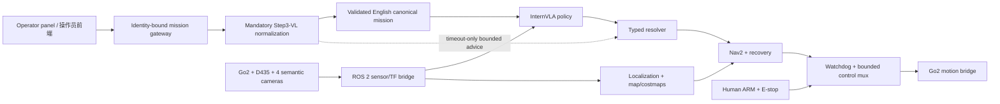

# E-MARS — Real Go2

**E-MARS — Edge-deployed Multimodal Agent for Robotic Search-and-rescue**
**E-MARS——基于端侧多模态 AI Agent 的自主消防救援机器人**

The `real-go2` branch is the strict physical-robot integration branch. It
connects multilingual high-level missions, mandatory Step3-VL normalization,
InternVLA, ROS 2, localization/mapping, Nav2, recovery, watchdogs, a bounded
control mux, Unitree Go2 sensors/state, Intel RealSense D435, and four semantic
cameras. The complete edge stack is intended to run on one DGX-class computer.

`real-go2` 是严格的物理机器人接入分支，连接多语言高层任务、强制 Step3-VL
规范化、InternVLA、ROS 2、定位/地图、Nav2、recovery、watchdog、有界 control
mux、Unitree Go2 传感器/状态、Intel RealSense D435 与四路语义相机。最终完整
机载栈应共置运行在一台 DGX 级计算机上。

## Documentation / 文档

- [Project overview / 项目说明](docs/project-overview.md)
- [Deployment guide / 部署说明](docs/deployment.md)
- [Technology stack / 技术栈说明](docs/technology-stack.md)
- [Hardware submodule / 硬件子模块](hardware)
- [Operator-panel submodule / 导航前端子模块](frontend)
- [Development journal / 开发日志](https://strtatqwq.github.io/dgx-hackathon-Journal/)

## Branch contract / 分支合同

| Branch / 分支 | Purpose / 用途 | Boundary / 边界 |
| --- | --- | --- |
| `sim` | Isaac functional development and evaluation / Isaac 功能研发与评测 | May contain named `completion_sim` deviations / 可包含显式仿真放宽 |
| `real-go2` | Strict physical Go2 integration and deployment / 严格 Go2 真机集成与部署 | Fail-closed; no simulation safety inheritance / fail-closed，禁止继承仿真安全放宽 |

The following are forbidden in `real-go2`: GT pose, simplified dynamics,
`use_sim_time=true`, raw-wire model bypass, WARN-only freshness/collision
policy, unbounded velocity, stale command replay, and direct frontend `cmd_vel`.

`real-go2` 禁止 GT pose、简化动力学、`use_sim_time=true`、raw-wire 模型旁路、
WARN-only freshness/collision 策略、无限制速度、旧命令重放，以及前端直接发布
`cmd_vel`。

## System at a glance / 系统一览



Raw Chinese or other operator text terminates at Step3-VL. InternVLA may
consume only the schema-validated, identity-bound English canonical mission.
Timeout, abstention, invalid JSON, stale identity, missing sensors/TF, unhealthy
watchdog, or unarmed state produces safe hold.

中文或其他操作员原始文本只能进入 Step3-VL。InternVLA 只能读取经过 schema
校验且绑定身份的英文 canonical mission。timeout、abstain、非法 JSON、过期身份、
传感器/TF 缺失、watchdog 不健康或身份不一致都必须进入 safe hold。

## Repository layout / 仓库结构

| Path / 路径 | Responsibility / 职责 |
| --- | --- |
| `configs/strict_real_go2.yaml` | Strict hardware, topics, UI, mission, and control policy / 严格硬件、话题、前端、任务与控制策略 |
| `configs/internnav_t5/strict_real_go2_mission_ingress.json` | Language/identity/control boundary / 语言、身份和控制边界 |
| `internvla_ros2`, `internvla_t4_sensors` | Typed model and sensor/mission client / 类型化模型与传感器/任务客户端 |
| `internvla_nav2_adapter`, `internvla_t4_recovery` | Nav2 command resolution and bounded recovery / Nav2 命令解析与有界恢复 |
| `slow_planner` | Step3 normalization and bounded advisor protocols / Step3 规范化与受限辅助协议 |
| `frontend` | Pinned `vla-nav-panel` submodule shared with the simulation branch / 与仿真分支共用的固定版本 `vla-nav-panel` 子模块 |
| `hardware` | Pinned Go2 edge-AI hardware-description submodule / 固定版本的 Go2 边缘 AI 硬件描述子模块 |
| `deploy/systemd`, `scripts` | Host-local services and launchers / 主机服务与启动器 |

## Clone / 克隆

```bash
git clone --branch real-go2 --recurse-submodules \
  https://github.com/strTATQwQ/E-MARS.git
cd E-MARS
git submodule update --init --recursive
cp .env.example .env.local
chmod 600 .env.local
```

Continue with the [strict deployment guide](docs/deployment.md). Do not arm or
publish non-zero motion during installation, discovery, calibration, or
stationary validation.

随后按照[严格部署说明](docs/deployment.md)操作。在安装、设备发现、标定和静止
验收阶段，禁止 arm 或发布任何非零运动。

## Public repository boundary / 公共仓库边界

Model weights, credentials, host addresses, calibration measurements, recorded
sensor streams, bags, test data, logs, reports, results, evidence bundles, and
videos are not committed. Store them in ignored host-local paths.

模型权重、凭证、主机地址、标定测量、传感器录制、bag、测试数据、日志、报告、
结果、证据包和视频都不得提交，必须保存在忽略的主机本地路径。

## License / 许可证

E-MARS is released under the [MIT License](LICENSE).
E-MARS 使用 [MIT License](LICENSE) 发布。
