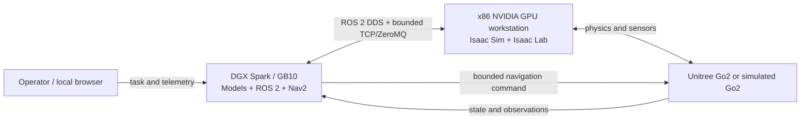

# E-MARS Local Deployment Guide

This guide documents the public deployment contract for E-MARS. It uses
placeholders such as `<DGX_HOST>`, `<ISAAC_HOST>`, and `<MODEL_PATH>` on purpose.
Do not replace them in committed files with internal IP addresses, usernames,
credentials, or machine-local absolute paths.

## 1. Local hardware topology



| Node | Responsibilities |
| --- | --- |
| DGX Spark / NVIDIA GB10 | InternVLA, Step3-VL, ROS 2, Nav2, localization, mapping, typed command resolution, watchdog, and operator telemetry. |
| x86 NVIDIA GPU workstation | Isaac Sim, Isaac Lab, USD scene loading, Go2 physics, sensor rendering, episode/reset lifecycle, evaluator, and simulation clock. |
| Unitree Go2 or simulator | Bounded command execution and motion/sensor feedback. The `sim` branch does not authorize physical Go2 autonomy. |

The preferred topology separates model/navigation compute from simulation.
Users with one machine can first run offline/mock components or a single Lane,
then move to the distributed topology. Model and simulation processes exchange
data through ROS 2 DDS, TCP/ZeroMQ, and the repository's bounded runtime
protocols. Only one component may own each command or clock authority.

## 2. Software environment

The documented local baseline is:

| Component | Baseline |
| --- | --- |
| Operating system | Ubuntu with a local NVIDIA GPU runtime |
| Robot middleware | ROS 2 Jazzy and Nav2 |
| Simulation | NVIDIA Isaac Sim 6.0.0.1 |
| Robot learning/simulation layer | NVIDIA Isaac Lab 6.1.14 |
| Accelerated ROS stack | NVIDIA Isaac ROS release 4.5 |
| GPU runtime | CUDA 13 |
| Model runtime | PyTorch 2.12.1+cu130 |
| Transformers | 4.57.6 |
| Isolation | Docker/ROS 2 GPU containers plus separate Python environments |

This table records the integration baseline. Component-scoped environments may
retain narrower package pins; their checked-in requirements and health contract
remain authoritative for that component. Do not upgrade a runtime solely to
match this overview without revalidating its checkpoint loader and control
contract.

Keep the model, ROS 2, and Isaac environments isolated. Before launch, verify
the NVIDIA driver and CUDA visibility, ROS 2 domain, required ports, model
revision, checkpoint completeness, and that no previous process still owns a
command, model, or simulation endpoint.

Use placeholders in local templates:

```bash
export DGX_HOST="<DGX_HOST>"
export ISAAC_HOST="<ISAAC_HOST>"
export STEP3_VL_10B_MODEL_PATH="<MODEL_PATH>/Step3-VL-10B"
export COSMOS_REASON2_32B_MODEL_PATH="<MODEL_PATH>/Cosmos-Reason2-32B"
export CUDA_VISIBLE_DEVICES="<GPU_ID>"
export ROS_DOMAIN_ID="<ROS_DOMAIN_ID>"
```

Store real values in an ignored local environment file. Never commit them.

## 3. Model and navigation bring-up

Bring the system up in this order so every layer is healthy before it can
receive motion authority:

1. Download model weights into `<MODEL_PATH>` and verify the expected revision,
   file inventory, and checksums.
2. Set `STEP3_VL_10B_MODEL_PATH`, `COSMOS_REASON2_32B_MODEL_PATH`, and the
   relevant InternVLA/InternNav path in a machine-local environment.
3. Create isolated Python/model and ROS 2 environments. Keep Isaac in its own
   workstation/container environment.
4. Load Step3-VL or Cosmos Reason2 in BF16 and require a clean checkpoint load,
   the expected dtype, and the pinned Transformers version.
5. Start the resident slow-planner service and query its health endpoint. The
   response must match the configured revision, dtype, token budget, batch size,
   and wall-clock contract.
6. Start the InternVLA fast path and confirm that it produces typed local
   trajectories or bounded action candidates rather than raw velocity ownership.
7. Start the ROS 2 sensor bridge, localization/mapping, Nav2, typed command
   resolver, recovery behavior, and watchdog. Confirm frame, clock, namespace,
   and observation freshness before enabling commands.
8. Start the Isaac worker and episode runner on `<ISAAC_HOST>`. Isaac owns the
   simulated world, sensor rendering, episode/reset lifecycle, evaluator, and
   simulation clock—not model, Nav2, or command authority.
9. Run the preflight/health gates in offline or single-Lane mode before a
   distributed model episode. A failed identity, sensor, model, transport, or
   command gate must fail closed.

Relevant repository entry points include:

- `configs/slow_models/step3_vl_10b_bf16.yaml`
- `configs/slow_models/cosmos_reason2_32b_bf16.yaml`
- `scripts/setup_t5_step3_runtime.sh`
- `scripts/run_t5_step3_live_services.sh`
- `scripts/run_t5_dgx_lane.sh`
- `scripts/run_t5_distributed_isaac.sh`

For optional simulation-only language normalization, keep the disabled profile
as the baseline or select one enabled profile:

```bash
# Local Step3-VL: reuse the resident service on TCP 8200.
python scripts/normalize_sim_instruction.py \
  --config configs/completion_sim/mission_normalization_step3_vl.yaml \
  --instruction "<TASK>" --mission-id "<MISSION_ID>" \
  --episode-id "<EPISODE_ID>"

# Hosted Step-3.7-Flash: start the text-only adapter on TCP 8210.
export STEPFUN_API_KEY="<LOCAL_SECRET>"
python -m slow_planner.serve \
  --config configs/slow_models/step_3_7_flash_normalizer.yaml
python scripts/normalize_sim_instruction.py \
  --config configs/completion_sim/mission_normalization_step37_flash.yaml \
  --instruction "<TASK>" --mission-id "<MISSION_ID>" \
  --episode-id "<EPISODE_ID>"
```

The command prints only the resolved instruction contract; it does not publish
motion. A runtime launcher should call it once at mission ingress, then bind the
canonical instruction and its matching tokenizer output to the episode/reset
identity before InternVLA starts. Reusing token IDs from a different source
instruction is invalid. Do not enable both providers for one mission.

These production-oriented launchers intentionally enforce resource leases,
identity, namespaces, and process ownership. Do not copy machine-specific
defaults from a launcher into public configuration; provide them through local
environment variables instead.

## 4. Large-model optimization

| Optimization | Public deployment contract |
| --- | --- |
| BF16 parameters and inference | Step3-VL and Cosmos Reason2 use BF16, with full-parameter dtype validation where required. |
| Resident model services | Keep models loaded across scenes/episodes to avoid repeated checkpoint loading. |
| Online batch size | Use `batch_size=1` for bounded online navigation latency. |
| Explicit GPU binding | Pin each Lane with `CUDA_VISIBLE_DEVICES` and isolate CPU, ports, result roots, ROS domain, and namespace. |
| KV cache | Reuse attention state when supported by the selected backend and request contract. |
| Deterministic decoding | Use a compact JSON schema, bounded candidates, and deterministic generation settings. |
| Step3-VL budget | Maximum 96 output tokens and a 10.5-second generation wall-clock budget. |
| Cosmos Reason2 budget | Maximum 48 output tokens. |
| Multi-view input | Use ordered four-camera multi-crop input with one snapshot identity and fixed image contracts. |
| Restricted search space | The slow planner compares frozen frontier, viewpoint, or motion-primitive candidates; it does not invent unrestricted velocity commands. |
| Checkpoint integrity | Require clean-load checks, the pinned model revision, and complete BF16 parameter validation. |
| Distributed runtime | Separate simulation and model/navigation compute, and isolate dual Lanes by GPU and ROS domain. |

The optimization goal is not only throughput. It is predictable, inspectable
latency inside a control chain that can reject stale or malformed decisions and
stop safely.

## Public boundary

The public repository does not include model weights, datasets, scene assets,
experimental results, run logs, raw camera streams, credentials, internal
addresses, usernames, or private filesystem paths. Provision these locally and
keep all generated evidence outside Git-tracked source directories.
